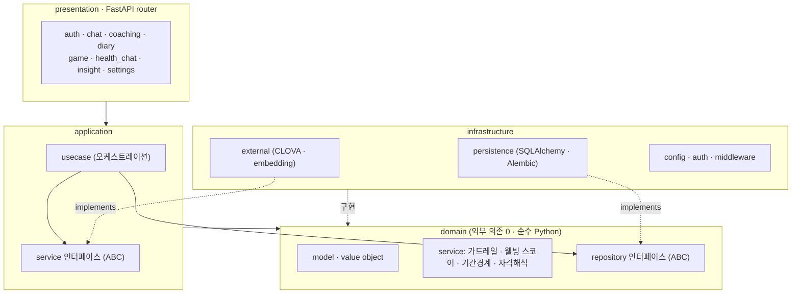
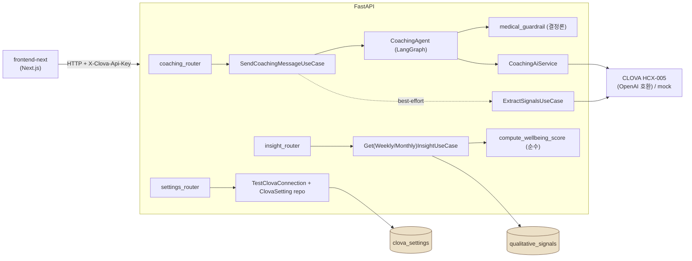
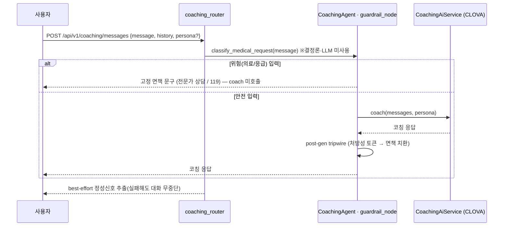
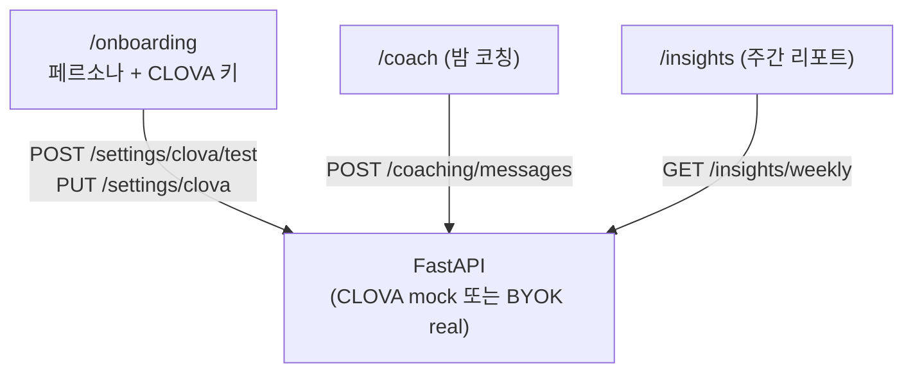

# Tamaya — Tamanya Medlife (건강냥 비서)

> 밤에 깨어나는 웰니스 동반자 — 1인 가구를 위한 대화형 건강·라이프스타일 코칭 AI

**Tamaya / Tamanya Medlife**는 한국의 20–30대 1인 가구를 위한 **온디바이스 우선** 웰니스 코칭 서비스입니다.
마스코트 **건강냥(Geongang-nyang)** 이 밤에 "깨어나" 하루를 함께 돌아보고, 수면·식사·운동·복약 같은
작은 건강 루틴을 부드럽게 권합니다. **진단·처방이 아닌 웰니스 코칭**을 지향하며, 의료 경계는 결정론
가드레일로 보호합니다. `liv-zz` 프로젝트의 MVP.

- **낮**: 가볍게 컨디션 체크인 · **밤**: 건강냥과 깊은 대화 + 다음날 미션 제안
- **정성신호**(정서 + 건강행동 언급) 추출 → 주/월 **웰빙 스코어** 인사이트
- **BYOK**: 사용자의 CLOVA 키를 요청별로 사용(평문 미저장), 키 없으면 mock으로 동작
- **안전 우선**: 의료 요구는 LLM 도달 전에 결정론 면책으로 단락

---

## 모노레포 구성

```
Tamaya/
├── backend/         # FastAPI · Clean Architecture + DDD (4 레이어)
├── frontend-next/   # Next.js 14 (App Router·TS·Tailwind) — FastAPI 실연동 ★
├── frontend/        # 기존 Vite/React v3 PoC (localStorage 전용, 점진 대체 예정)
├── docker-compose.yml   # Postgres(pgvector) 서비스
└── Makefile             # up / down / migrate / be / fe ...
```

> **frontend-next/** 가 현재의 실연동 프런트엔드입니다(온보딩·밤코칭·주간리포트 3화면이 FastAPI 호출).
> 기존 `frontend/`(Vite)는 backend 미연동 wireframe PoC로, 패리티 도달 시 대체됩니다.

---

## 아키텍처 (Architecture)

### 1) Clean Architecture 레이어

의존성은 항상 안쪽(domain)을 향합니다: `presentation → application → domain ← infrastructure`.



### 2) 시스템 컴포넌트 맵 (요청 흐름)



### 3) 가드레일-우선 코칭 흐름 (안전 단락)

위험 입력은 **LLM 호출 전에** 결정론적으로 면책으로 단락됩니다. 실제 CLOVA 키를 써도 동일하게 적용됩니다.



### 4) 프런트엔드 ↔ FastAPI 와이어링



---

## 기술 스택 (Tech Stack)

| 영역 | 스택 |
|---|---|
| **Backend** | Python 3.13 · FastAPI · Uvicorn · SQLAlchemy 2(async) + Alembic · LangGraph |
| **DB / Vector** | PostgreSQL 16 (`pgvector/pgvector:pg16`) · asyncpg · **`Vector(384)`** (sentence-transformers `paraphrase-multilingual-MiniLM-L12-v2`) |
| **AI** | Naver CLOVA(OpenAI 호환, `HCX-005`) · 기본 `CLOVA_MOCK_MODE=true` |
| **Auth** | Kakao OAuth(`httpx`) + JWT(`python-jose`) · 익명 `device_id` 키잉 |
| **Frontend (next)** | Next.js 14 (App Router) · React 18 · TypeScript 5 · Tailwind 3 |
| **Frontend (PoC)** | React 18 · Vite 5 (backend 미연동) |
| **Tooling** | uv(backend) · pnpm(frontend) · ruff · ESLint · Playwright(e2e) |

> ⚠️ 정정: 임베딩은 **384-dim**(`Vector(384)`)입니다. 일부 옛 마이그레이션 파일명에 "1024"가 있으나 실제 스키마는 384입니다.

---

## API 엔드포인트 (주요)

| Method · Path | 설명 | DB |
|---|---|---|
| `POST /api/v1/coaching/messages` | 밤 코칭(guardrail-first). `X-Clova-Api-Key`로 BYOK | mock 경로는 불필요 |
| `GET /api/v1/insights/weekly?device_id&week=YYYY-Www` | 주간 웰빙 스코어 + 일별 trend | 필요 |
| `GET /api/v1/insights/monthly?device_id&month=YYYY-MM` | 월간(주별 trend) | 필요 |
| `POST /api/v1/settings/clova/test` | CLOVA 키 연결 테스트 → `{ok, masked}` | 불필요 |
| `PUT/GET /api/v1/settings/clova` | 마스킹 키 프리뷰 저장/조회(원문 미저장) | 필요 |
| `GET /health` | 헬스체크 → `{"status":"ok"}` | 불필요 |

그 외 기존 라우터: `auth · chat · diary · game · health_chat`.

---

## 시작하기 (Getting Started)

### Prerequisites
- Python 3.13+ · [uv](https://github.com/astral-sh/uv)
- Node.js 18+ (dev: Node 20/24) · [pnpm](https://pnpm.io)
- Docker (PostgreSQL용 — insights/설정 영속에 필요)

### Backend (port 8000)

```bash
make up                  # Postgres(pgvector) 기동 (docker compose)
cd backend && uv sync    # 의존성
make migrate             # alembic upgrade head (스키마 관리 유일 경로)
make be                  # uvicorn app.main:app --reload --port 8000
```

- `CLOVA_MOCK_MODE`가 기본 `true` → 실제 키 없이도 구동(코칭은 canned 응답).
- CORS 허용 origin: `localhost`/`127.0.0.1` 의 `3000`·`5173`(+ Expo `19006`).

### Frontend — Next.js (port 3000, 실연동)

```bash
cd frontend-next && pnpm install
NEXT_PUBLIC_API_BASE=http://127.0.0.1:8000 pnpm dev   # http://127.0.0.1:3000
pnpm build       # 프로덕션 빌드(tsc 포함)
pnpm test:e2e    # Playwright e2e (백엔드 mock 기동 전제)
```

화면: `/onboarding`(페르소나+키) · `/coach`(밤 코칭) · `/insights`(주간 리포트).

### Frontend — Vite PoC (port 5173, 레거시)

```bash
cd frontend && pnpm install && pnpm dev   # 375×812 phone shell, #design 캔버스
```

---

## BYOK (Bring-Your-Own-Key)

사용자가 자신의 CLOVA 키를 넣으면 해당 요청만 **실제 CLOVA**로 동작합니다.

- 우선순위: **사용자 키(`X-Clova-Api-Key` 헤더) > env(`CLOVA_API_KEY`) > mock**
- env(`settings`)는 어떤 경로로도 변경되지 않음(요청별 격리)
- 키 보안: 응답·서버 저장·로그에 **평문 미노출**(마스킹 `••••last4`만 보관), mock 폴백 시 클라이언트에 자격 미적재(최소권한)

```bash
# 예: 실제 키로 코칭 호출
curl -X POST http://127.0.0.1:8000/api/v1/coaching/messages \
  -H "Content-Type: application/json" -H "X-Clova-Api-Key: <YOUR_KEY>" \
  -d '{"device_id":"dev-1","message":"요즘 잠을 잘 못 자","history":[],"persona":"친구"}'
```

---

## 안전 · 프라이버시

- **의료 면책 가드레일**: `domain/service/medical_guardrail.py` — LLM 비의존 키워드 분류 + 고정 면책 문구. 위험 입력은 coach 호출 전 단락, 응급은 119 안내. 생성 응답의 처방성 토큰은 post-generation tripwire가 치환.
- **회귀 하드게이트**: 큐레이트 위험 프롬프트 ≥10건 100% 단락을 CI에서 검증.
- **PII/건강데이터**: 정성신호는 파생 태그(emotion enum + 짧은 behavior + polarity)만 저장, 원문 의료 주장 미저장. best-effort 로그는 예외 타입만 기록.

---

## 테스트 · CI

- Backend: `cd backend && uv run pytest -q` → **104 tests green**, `uv run ruff check .`
- CI(`.github/workflows/ci.yml`): `frontend`(Vite build) · `backend`(ruff + compileall + **pytest 하드게이트**) · `e2e`(uvicorn mock + Next + Playwright)
- 검증 추적: [VERIFICATION.md](./VERIFICATION.md) (AC-1~8 매핑)

> 라이브 검증: 실제 CLOVA 키(BYOK 헤더)로 코칭 응답 생성 확인, 위험 입력은 실키에서도 결정론 면책으로 단락됨을 확인.

---

## DB / 마이그레이션

스키마는 **Alembic migration이 유일한 관리 수단**입니다(`main.py`에서 `create_all` 제거). 단일 head 유지.

```bash
make migrate    # cd backend && alembic upgrade head
```

`alembic/versions/`에 8개 revision (정성신호 `qualitative_signals`, BYOK `clova_settings` 포함).

---

## 라이선스 (License)

[Apache License 2.0](./LICENSE) — Copyright © 2026 라이프매니저스 (Life Managers) · 나재학.
